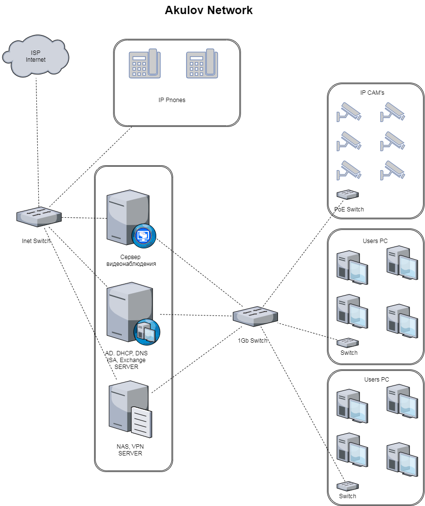

## Домашнее задание к занятию "3.8. Компьютерные сети, лекция 3"
##
## Вопрос 1. Подключитесь к публичному маршрутизатору в интернет. Найдите маршрут к вашему публичному IP
**~$ telnet route-views.routeviews.org**

Username: rviews

**route-views>show ip route 193.93.x.x**

Routing entry for 193.93.120.0/22, supernet

  Known via "bgp 6447", distance 20, metric 0

  Tag 6939, type external

  Last update from 64.71.137.241 3w3d ago

  Routing Descriptor Blocks:

  * 64.71.137.241, from 64.71.137.241, 3w3d ago

      Route metric is 0, traffic share count is 1

      AS Hops 3

      Route tag 6939

      MPLS label: none

 

**route-views>show bgp 193.93.x.x**

BGP routing table entry for 193.93.120.0/22, version 1340999758

Paths: (24 available, best #16, table default)

.........................................
##
## Вопрос 2. Создайте dummy0 интерфейс в Ubuntu. Добавьте несколько статических маршрутов. Проверьте таблицу маршрутизации.
**~$ sudo modprobe -v dummy numdummies=1**

**~$ lsmod | grep dummy** Проверяем загрузился ли модуль

**~$ ifconfig -a | grep dummy** Проверяем создался ли интерфейс

_dummy0: flags=130<BROADCAST,NOARP> mtu 1500_ Все ок, интерфейс есть

**~$ sudo ip addr add 100.64.0.0/10 dev dummy0** Добавляем IP адрес

**~$ sudo ip link set dummy0 address 00:00:00:11:11:11** Изменяем MAC адрес интерфейса

Добавляем два новых статических маршрута

**~$ sudo ip route add 100.64.0.0/10 via 192.168.16.115**

**~$ sudo ip route add 100.64.0.0/10 dev lo metric 200**

Проверяем таблицу маршрутизации

**~$ sudo ip route show**

100.64.0.0/10 via 192.168.16.115 dev enp3s0 

100.64.0.0/10 dev lo scope link metric 200 

**Новые маршруты появились**
##
## Вопрос 3. Проверьте открытые TCP порты в Ubuntu, какие протоколы и приложения используют эти порты? Приведите несколько примеров.
**~$ ss -tp**

State Recv-Q Send-Q Local Address:Port        Peer Address:Port        Process                                  

ESTAB 0         0          192.168.16.115:43186   35.244.174.68:https      users:(("chrome",pid=6255,fd=177))      

ESTAB 0         0          192.168.16.115:60370   185.199.108.153:https  users:(("chrome",pid=6255,fd=35))       

ESTAB 0         0          192.168.16.115:43314   23.73.4.78:https            users:(("chrome",pid=6255,fd=31))         

ESTAB 0         0          192.168.16.115:55050   185.64.190.80:https      users:(("chrome",pid=6255,fd=235))      
##
## Вопрос 4. Проверьте используемые UDP сокеты в Ubuntu, какие протоколы и приложения используют эти порты?
**$ ss -uap**

State Recv-Q Send-Q Local Address:Port        Peer Address:Port      Process                                    

ESTAB 0        0           192.168.16.115:50692   74.125.131.153:443    users:(("chrome",pid=6255,fd=29))      

ESTAB 0        0           192.168.16.115:42726   74.125.205.155:443    users:(("chrome",pid=6255,fd=32))      

ESTAB 0        0           192.168.16.115:59169   64.233.164.104:443    users:(("chrome",pid=6255,fd=36))       
##
## Вопрос 5. Используя diagrams.net, создайте L3 диаграмму вашей домашней сети или любой другой сети, с которой вы работали.

