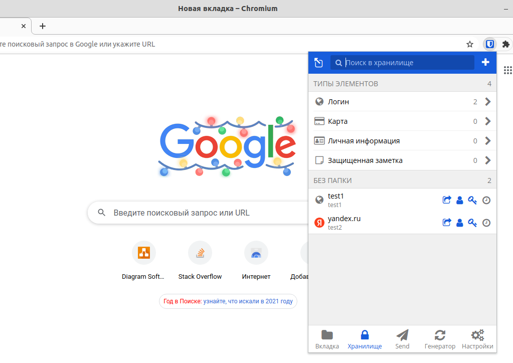
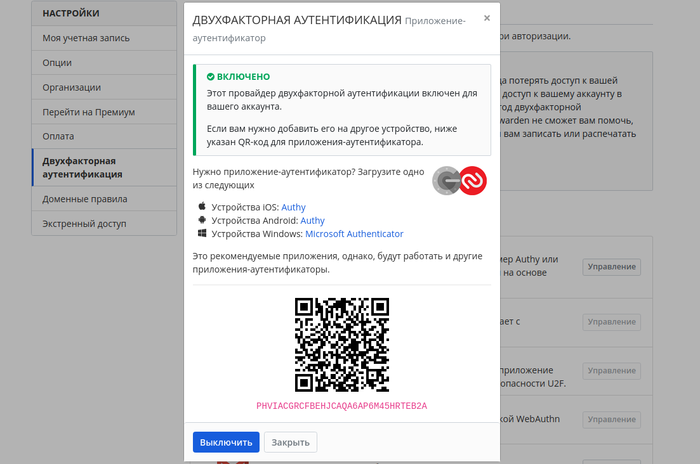
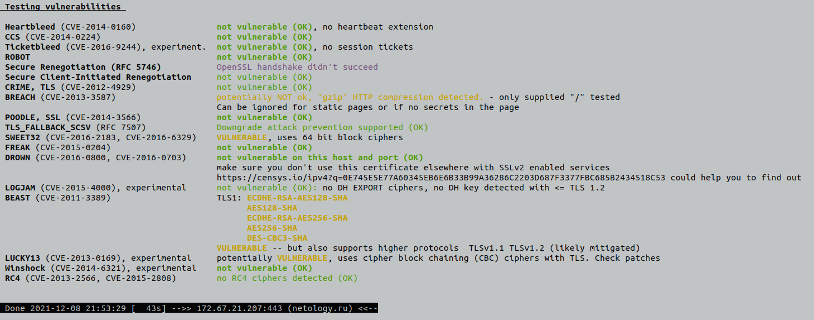

# Домашнее задание к занятию "3.9. Элементы безопасности информационных систем"
# 
# Вопрос 1. Установите Bitwarden плагин для браузера. Зарегистрируйтесь и сохраните несколько паролей.

#
# Вопрос 2. Установите Google authenticator на мобильный телефон. Настройте вход в Bitwarden аккаунт через Google authenticator OTP.

#
# Вопрос 3. Установите apache2, сгенерируйте самоподписанный сертификат, настройте тестовый сайт для работы по HTTPS.

**~$ sudo apt install apache2** Устанавливаем apache2

**~$ sudo systemctl enable apache2** Добавляем установленный сервер в автозагрузку

**~$ openssl req -new -x509 -days 30 -keyout server.key -out server.pem** Генерируем SSL-ключ

Снимаем пароль с ключа, для удобства тестирования

**~$ cp server.key{,.orig}**

**~$ openssl rsa -in server.key.orig -out server.key**

Enter pass phrase for server.key.orig:

writing RSA key

**~$ rm server.key.orig**

Скопируем их в /etc/ssl и назначим файлу ключа права чтения только администратору:

**~$ sudo cp server.pem /etc/ssl/certs/**

**~$ sudo cp server.key /etc/ssl/private/**

**~$ sudo chmod 0600 /etc/ssl/private/server.key**

**~$ sudo a2enmod ssl** Активируем модуль ssl

**~$ sudo a2ensite default-ssl** Включаем настройки HTTPS сайта по умолчанию

**~$ sudo nano /etc/apache2/sites-enabled/default-ssl.conf** Редактируем файл с настройками HTTPS сайта 

SSLProtocol all -SSLv2 Запретить использование устаревшего протокола

Редактируем месторасположения сертификатов

SSLCertificateFile /etc/ssl/certs/server.pem 

SSLCertificateKeyFile /etc/ssl/private/server.key

Создаем сайт

**~$ sudo nano /etc/apache2/sites-available/test.ru.conf**

<VirtualHost *:80>

    #Имя хоста

    ServerName test.ru 

    ServerAlias www.test.ru

    #Корневая папка хоста

    DocumentRoot /var/www/test.ru/public_html

    Redirect / https://test.ru/

</VirtualHost>

**~$ sudo nano /etc/hosts**

127.0.1.1 test.ru

**~$ sudo a2ensite test.ru** Включаем новый виртуальный хост

**~$ sudo systemctl reload apache2 **

В браузере вводим **test.ru** открывается **https://test.ru/**
#
# Вопрос 4. Проверьте на TLS уязвимости произвольный сайт в интернете (кроме сайтов МВД, ФСБ, МинОбр, НацБанк, РосКосмос, РосАтом, РосНАНО и любых госкомпаний, объектов КИИ, ВПК ... и тому подобное).

**~$ git clone --depth 1 https://github.com/drwetter/testssl.sh.git**

**~$ cd testssl.sh**

**~/testssl.sh$ ./testssl.sh -U --sneaky https://netology.ru/**

#
# Вопрос 5. Установите на Ubuntu ssh сервер, сгенерируйте новый приватный ключ. Скопируйте свой публичный ключ на другой сервер. Подключитесь к серверу по SSH-ключу.

**~$ sudo apt install openssh-server**

**~$ sudo systemctl start sshd.service**

**~$ ssh-keygen** Генерируем ключи

**~$ ssh-copy-id vagrant@localhost -p 2222** Копируем созданный ключ на виртуальную машину vagrant

**~$ ssh vagrant@localhost -p 2222** Подключаемся к виртуальной машине без запроса пароля по ключу ssh
#
# Вопрос 6. Переименуйте файлы ключей из задания 5. Настройте файл конфигурации SSH клиента, так чтобы вход на удаленный сервер осуществлялся по имени сервера.
**~$ sudo nano ~/.ssh/config** Редактируем SSH-config

Host test-vagrant

  HostName 127.0.0.1

  IdentityFile ~/.ssh/id_ed25519

  User vagrant

  Port 2222

**~$ ssh test-vagrant** Успешно подключаемся к виртуальной машине по настроенному имени хоста
#
# Вопрос 7. Соберите дамп трафика утилитой tcpdump в формате pcap, 100 пакетов. Откройте файл pcap в Wireshark.

**~$ sudo apt install tcpdump** Устанавливаем tcpdump

**~$ sudo tcpdump -c 100 -w 01.pcap -i enp2s0** Собираем дамп трафика

**~$ sudo apt install wireshark** Устанавливаем wireshark

**~$ sudo wireshark -r 01.pcap** Открываем собранный ранее дамп в wireshark