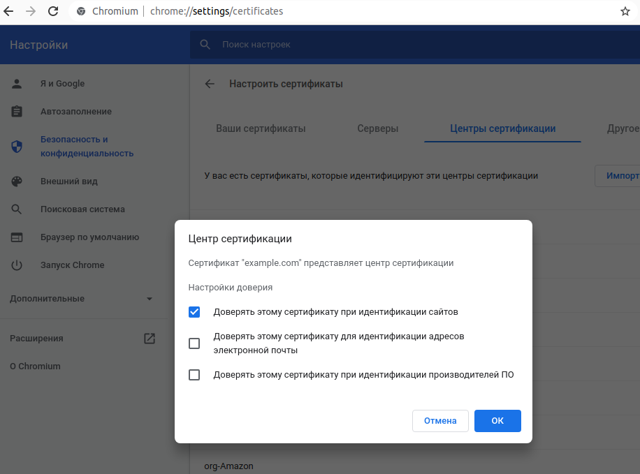
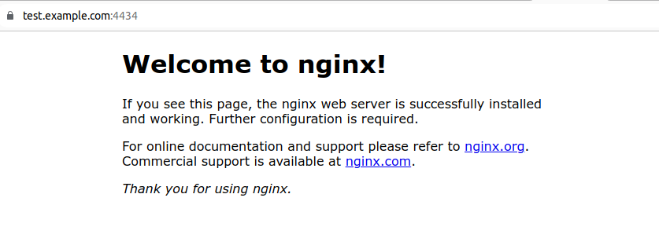
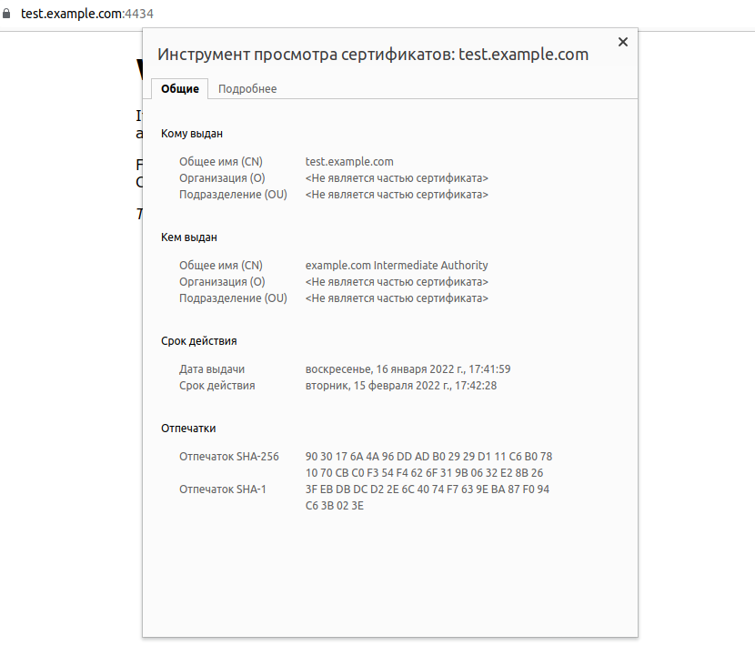
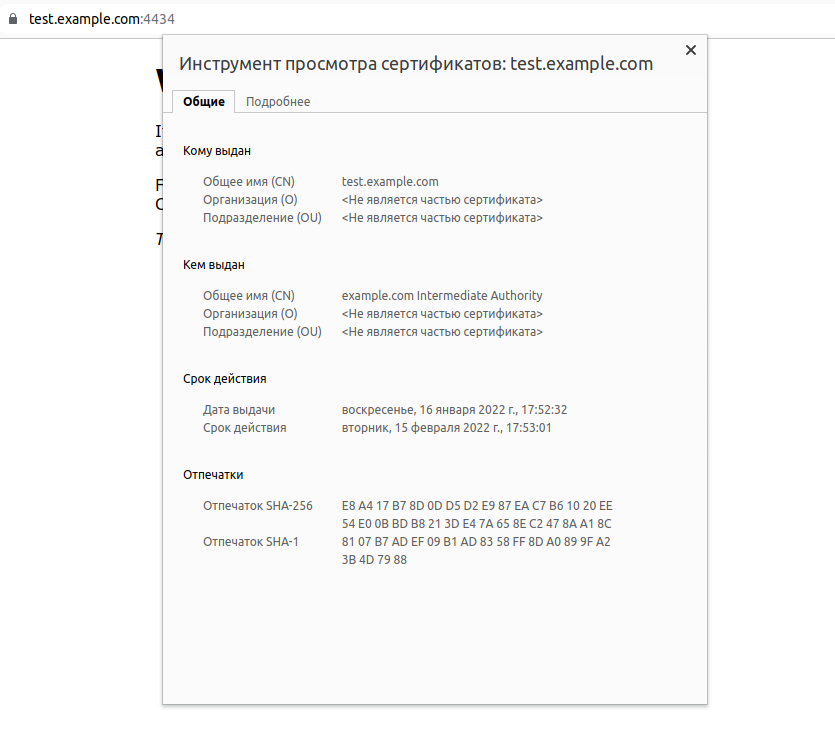

# Курсовая работа по итогам модуля "DevOps и системное администрирование"
---
---

### 1. Создайте виртуальную машину Linux.
```
uadmin@ub1:~/vagrant$ vagrant up
```
---
### 2. Установите ufw и разрешите к этой машине сессии на порты 22 и 443, при этом трафик на интерфейсе localhost (lo) должен ходить свободно на все порты.
```
root@vagrant:~# ufw enable
Command may disrupt existing ssh connections. Proceed with operation (y|n)? y
Firewall is active and enabled on system startup
```
Политика по умолчанию будет отклонять все входящие пакеты
```
root@vagrant:~# ufw default deny incoming
Default incoming policy changed to 'deny'
(be sure to update your rules accordingly)
```
Разрешаем сессии на порты 22 и 443
```
root@vagrant:~# ufw allow 22
Rule added
Rule added (v6)
root@vagrant:~# ufw allow 443
Rule added
Rule added (v6)
```
Добавляем разрешающие правила для localhost
```
root@vagrant:~# ufw allow from 127.0.0.1 to any
Rule added
root@vagrant:~# ufw allow from any to 127.0.0.1
Rule added
```
Проверяем созданные правила
```
root@vagrant:~# ufw status verbose
Status: active
Logging: on (low)
Default: deny (incoming), allow (outgoing), disabled (routed)
New profiles: skip
To Action From
22 ALLOW IN Anywhere                  
443 ALLOW IN Anywhere                  
Anywhere ALLOW IN 127.0.0.1                 
127.0.0.1 ALLOW IN Anywhere                  
```
---
### 3. Установите hashicorp vault.
```
root@vagrant:~# curl -fsSL https://apt.releases.hashicorp.com/gpg | sudo apt-key add -
root@vagrant:~# sudo apt-add-repository "deb [arch=amd64] https://apt.releases.hashicorp.com $(lsb_release -cs) main"
root@vagrant:~# sudo apt-get update && sudo apt-get install vault
root@vagrant:~# unset VAULT_TOKEN
```
Создаем каталоги данных Vault
```
root@vagrant:~# mkdir /etc/vault
root@vagrant:~# mkdir -p /var/lib/vault/data
```
Создаем пользователя с именем vault
```
root@vagrant:~# useradd --system --home /etc/vault --shell /bin/false vault
root@vagrant:~# chown -R vault:vault /etc/vault /var/lib/vault/
```
Создаем файл службы Vault
```
root@vagrant:~# cat <<EOF | sudo tee /etc/systemd/system/vault.service
[Unit]
Description="HashiCorp Vault - A tool for managing secrets"
Documentation=https://www.vaultproject.io/docs/
Requires=network-online.target
After=network-online.target
ConditionFileNotEmpty=/etc/vault/config.hcl
[Service]
User=vault
Group=vault
ProtectSystem=full
ProtectHome=read-only
PrivateTmp=yes
PrivateDevices=yes
SecureBits=keep-caps
AmbientCapabilities=CAP_IPC_LOCK
NoNewPrivileges=yes
ExecStart=/usr/bin/vault server -config=/etc/vault/config.hcl
ExecReload=/bin/kill --signal HUP 
KillMode=process
KillSignal=SIGINT
Restart=on-failure
RestartSec=5
TimeoutStopSec=30
StartLimitBurst=3
LimitNOFILE=65536
[Install]
WantedBy=multi-user.target
EOF
```
Создаем конфигурационный файл
```
root@vagrant:~# cat <<EOF | sudo tee /etc/vault/config.hcl
storage "file" {
  path = "/var/lib/vault/data"
}

listener "tcp" {
  address = "127.0.0.1:8200"
  tls_disable = "true"
}

api_addr = "http://127.0.0.1:8200"
cluster_addr = "https://127.0.0.1:8201"
ui = true
EOF
```
Запускаем и включаем службу vault для запуска при загрузке системы
```
root@vagrant:~# systemctl daemon-reload
root@vagrant:~# systemctl enable --now vault
```
Экспортируеv переменную среды VAULT_ADDR перед инициализацией сервера Vault.
```
root@vagrant:~# export VAULT_ADDR='http://127.0.0.1:8200'
root@vagrant:~# echo "export VAULT_ADDR=http://127.0.0.1:8200" >> ~/.bashrc
```
Инициализируем Vault
```
root@vagrant:~# rm -rf /var/lib/vault/data/*
root@vagrant:~# vault operator init > /etc/vault/init.file
```
Распечатываем Vault, вводим 3 ключа
```
root@vagrant:~# vault operator unseal
```
Аунтифицируемся используя корневой токен
```
root@vagrant:~# vault login
```
---
### 4. Создайте центр сертификации  и выпустите сертификат для использования его в настройке веб-сервера nginx (срок жизни сертификата - месяц).

Устанавливаем утилиту jq
```
root@vagrant:~# apt install jq
```
Создаем политику для PKI
```
root@vagrant:~# nano admin-policy.hcl
root@vagrant:~# vault policy write admin /etc/vault/admin-policy.hcl
```
Активируем PKI тип секрета для корневого центра сертификации
```
root@vagrant:~# vault secrets enable pki
root@vagrant:~# vault secrets tune -max-lease-ttl=87600h pki
```
Создаем корневой сертификат
```
root@vagrant:~# vault write -field=certificate pki/root/generate/internal \
  common_name="example.com" \
  ttl=87600h > CA_cert.crt
```
Публикуем URL’ы для корневого центра сертификации
```
root@vagrant:~# vault write pki/config/urls \
   issuing_certificates="$VAULT_ADDR/v1/pki/ca" \
   crl_distribution_points="$VAULT_ADDR/v1/pki/crl"
```
Активируем PKI тип секрета для промежуточного центра сертификации
```
root@vagrant:~# vault secrets enable -path=pki_int pki
```
Генерируем запрос на выдачу сертификата для промежуточного центра сертификации
```
root@vagrant:~# vault write -format=json pki_int/intermediate/generate/internal \
   common_name="example.com Intermediate Authority" \
   | jq -r '.data.csr' > pki_intermediate.csr
```
Отправляем полученный CSR-файл в корневой центр сертификации, получаем сертификат для промежуточного центра сертификации.
```
root@vagrant:~# vault write -format=json pki/root/sign-intermediate csr=@pki_intermediate.csr \
   format=pem_bundle ttl="43800h" \
   | jq -r '.data.certificate' > intermediate.cert.pem
```
Публикуем подписанный сертификат промежуточного центра сертификации
```
root@vagrant:~# vault write pki_int/intermediate/set-signed certificate=@intermediate.cert.pem
```
Создаем роль, с помощью которой будем выдавать сертификаты
```
root@vagrant:~# vault write pki_int/roles/example-dot-com \
   allowed_domains="example.com" \
   allow_subdomains=true \
   max_ttl="720h"
```
Создаем сертификат на 1 месяц для домена test.example.com и записываем его в json формат для дальнейшего использования
```
root@vagrant:~# vault write -format=json pki_int/issue/example-dot-com common_name="test.example.com" ttl="720h" > /etc/nginx/ssl/test.example.com.crt
```
---
### 5. Установите корневой сертификат созданного центра сертификации в доверенные в хостовой системе.

Копируем сертификат на хостовую машину и импортируем в доверенные корневые центры сертификации в браузере
```
uadmin@ub1:~/vagrant$ vagrant scp default:/home/vagrant/CA_cert.crt /home/uadmin
echo "127.0.0.1 test.example.com" >> /etc/hosts
```

---
### 6. Установите nginx.
```
root@vagrant:~# apt install nginx
root@vagrant:~#  ufw allow 'Nginx HTTPS'
root@vagrant:~# systemctl status nginx
```
---
### 7. По инструкции настройте nginx на https, используя ранее подготовленный сертификат:

Создаем папку для хранения сертификатов
```
root@vagrant:~# mkdir /etc/nginx/ssl
```
Записываем в нее сертификат и ключ
```
root@vagrant:~# cat /etc/nginx/ssl/test.example.com.crt | jq -r .data.certificate > /etc/nginx/ssl/test.example.com.pem
root@vagrant:~# cat /etc/nginx/ssl/test.example.com.crt | jq -r .data.ca_chain[] >> /etc/nginx/ssl/test.example.com.pem
root@vagrant:~# cat /etc/nginx/ssl/test.example.com.crt | jq -r .data.private_key > /etc/nginx/ssl/test.example.com.key
```
Настраиваем файл конфигурации nginx
```
root@vagrant:~# nano /etc/nginx/nginx.conf
server {
                listen 443 ssl;
                server_name test.example.com;
                ssl_certificate ssl/test.example.com.pem;
                ssl_certificate_key ssl/test.example.com.key;
                ssl_protocols TLSv1 TLSv1.1 TLSv1.2;
                ssl_ciphers HIGH:!aNULL:!MD5;
}
```
Проверяем синтаксис файла конфигурации
```
root@vagrant:~# nginx -t
```
Перезагружаем nginx
```
root@vagrant:~# systemctl reload nginx
```
---
### 8. Откройте в браузере на хосте https адрес страницы, которую обслуживает сервер nginx.




---
### 9. Создайте скрипт, который будет генерировать новый сертификат в vault:

```
root@vagrant:~# nano /etc/nginx/ssl/script_crt
#!/bin/bash
export VAULT_ADDR=http://127.0.0.1:8200
#Задаем переменные для вывода времени
D=$(date +%Y-%m-%d)
T=$(date +%H:%M:%S)
vault status #Запускаем проверку состояния vault
if [ $? -eq 0 ] #Если vault находится в состоянии unsealed
then #запускаем выпуск нового секртификата
 vault write -format=json pki_int/issue/example-dot-com \
  common_name="test.example.com" ttl="720h" > \
  /etc/nginx/ssl/test.example.com.crt
 cat /etc/nginx/ssl/test.example.com.crt | jq -r .data.certificate > \
  /etc/nginx/ssl/test.example.com.pem
 cat /etc/nginx/ssl/test.example.com.crt | jq -r .data.ca_chain[] >> \
  /etc/nginx/ssl/test.example.com.pem
 cat /etc/nginx/ssl/test.example.com.crt | jq -r .data.private_key > \
  /etc/nginx/ssl/test.example.com.key
 systemctl reload nginx
 echo "The Certificate for NGINX was successfully updated at" "$D" "$T" >> \
  /var/log/nginx/cert_update.log
else #Если vault запечатан либо не запущен - выводим сообщение об ошибке
 D=$(date +%Y-%m-%d)
 T=$(date +%H:%M:%S)
 echo "ERROR" "$D" "$T" "The Vault Server is in the sealed state" >> \
  /var/log/nginx/cert_update.log
fi

root@vagrant:~# chmod +x /etc/nginx/ssl/script_crt
```

---
### 10. Поместите скрипт в crontab, чтобы сертификат обновлялся какого-то числа каждого месяца в удобное для вас время.

```
root@vagrant:~# crontab -e
53 17 16 * * /etc/nginx/ssl/script_crt
root@vagrant:~# service cron reload
```

