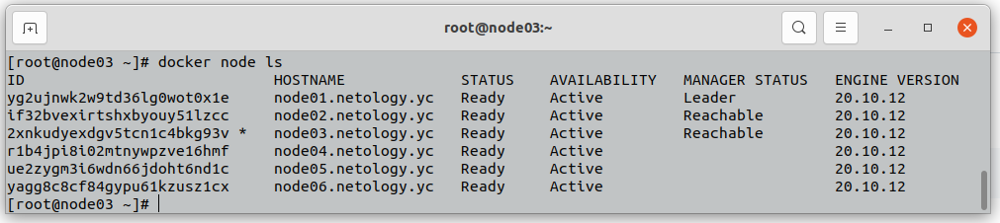
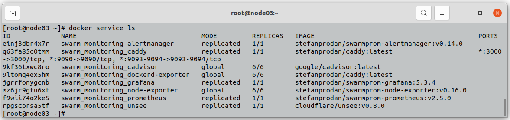

# Домашнее задание к занятию "5.5. Оркестрация кластером Docker контейнеров на примере Docker Swarm"

---

## Задача 1

Дайте письменые ответы на следующие вопросы:

- В чём отличие режимов работы сервисов в Docker Swarm кластере: replication и global?

Replicated и Global - это два способа запуска сервисов в кластере Docker Swarm. 

В случае запуска реплицированного сервиса, мы указываем требуемое колличество реплик необходимого нам сервиса, и docker swarm сам запускает экземпляры указанного сервиса в нужном колличестве на нодах своего кластера.

В случае запуска глобального сервиса, docker swarm разворачивает указанный сервис на всех нодах кластера автоматически. При добавлении новых нод в кластер, оркестратор автоматически поднимет глобальный сервис в новой ноде.

- Какой алгоритм выбора лидера используется в Docker Swarm кластере?

Для выбора лидера в кластере Docker Swarm используется алгоритм поддержания распределенного консенсуса RAFT. 
Данный алгоритм работает следующим образом: управляющая нода кластера (leader), через равные промежутки времени, рассылает служебные сообщения всем нодам кластера входящим в группу менеджеров (followers). Если follower за определенный промежуток времени получает служебное сообщение от leader, он отвечает на это сообщение и продолжает быть нодой со статусом follower. Если лидирующая нода выходит из строя, фоловеры перестают получать от нее служебные сообщения, начинается процедура выбора нового лидера среди работающих нод со статусом follower. Если кратко, они обмениваются с друг другом сообщениями в которых отправляют запрос на лидерство в данном кластере, через какое-то время, набрав нужное количество голосов, лидером изберается новая нода, теперь она управляет кластером.

- Что такое Overlay Network?

Overlay-сеть создает подсеть, которую могут использовать контейнеры находящиеся в разных (физических или виртуальных) хостах одного кластера docker swarm. 

Overlay-сеть использует технологию vxlan, при помощи которой Docker создает виртуальные сети поверх существующих связей между хостами. Любые точки, которые являются частью этой виртуальной сети, выглядят друг для друга так, будто они связаны поверх свича и не заботятся об устройстве основной физической сети. Эти сети служат общей подсетью для контейнеров единой сети, в которой они могут обмениваться данными напрямую (даже если они запущены на разных физических хостах)

---

## Задача 2

Создать ваш первый Docker Swarm кластер в Яндекс.Облаке

Для получения зачета, вам необходимо предоставить скриншот из терминала (консоли), с выводом команды:
```
docker node ls
```



---

## Задача 3

Создать ваш первый, готовый к боевой эксплуатации кластер мониторинга, состоящий из стека микросервисов.

Для получения зачета, вам необходимо предоставить скриншот из терминала (консоли), с выводом команды:
```
docker service ls
```



---

## Задача 4 (*)

Выполнить на лидере Docker Swarm кластера команду (указанную ниже) и дать письменное описание её функционала, что она делает и зачем она нужна:
```
# см.документацию: https://docs.docker.com/engine/swarm/swarm_manager_locking/
docker swarm update --autolock=true
```
Безопасность работы кластера docker swarm основана на использовании ключей шифрования: для шифрования логов системы RAFT и служебной коммуникации между нодами кластера. По умолчанию, при перезагрузке кластера ключи шифрования загружаются в память каждой управляющей ноды, ноды-менеджеры автоматически разблокируются и запускают требуемые сервисы. Использование фичи --autolock позволяет настроить кластер таким образом, что ключи шифрования будут храниться в зашифрованном виде, при перезагрузке кластера, чтобы их расшифровать и корректно включить кластер с развернутыми на нем сервисами придется вручную, используя команду docker swarm unlock, после чего потребуется ввести unlock key.

---

