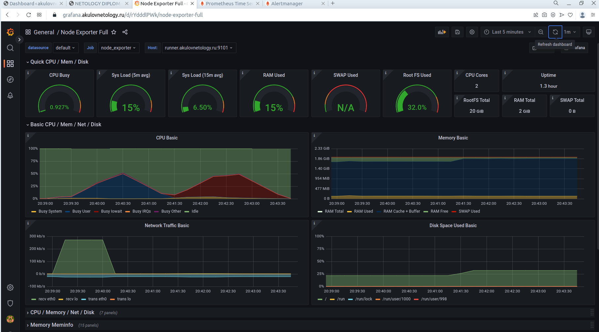

# Дипломное задание по курсу «DevOps-инженер»

1. Зарегистрировать доменное имя (любое на ваш выбор в любой доменной зоне).
Зарегистрированно доменное имя akulovnetology.ru в доменной зоне RU

2. Подготовить инфраструктуру с помощью Terraform на базе облачного провайдера YandexCloud.
Вся необходимая для проекта инфраструктура создается средствами Terraform в ЯО.
[Terraform repository](./terraform/)

Все последующие цели реализованны средствами ansible
[Ansible repository](./ansible/)

3. Настроить внешний Reverse Proxy на основе Nginx и LetsEncrypt.
Данная цель реализована с помощью следующих ansible ролей:
[nginx](./ansible/roles/nginx/)
[certbot](./ansible//roles/certbot/)
[nginx-https-config](./ansible/roles/nginx-https-config/)

4. Настроить кластер MySQL.
Данная цель реализована с помощью следующих ansible ролей:
[mysql-master](./ansible/roles/mysql-master/)
[mysql-slave](./ansible/roles/mysql-slave/)

5. Установить WordPress.
Данная цель реализована с помощью следующих ansible ролей:
[wordpress](./ansible/roles/wordpress)

Скриншот работающего wordpress с валидных сертификатом

Скриншот созданной страницы средствами wordpress

6. Развернуть Gitlab CE и Gitlab Runner.
Данная цель реализована с помощью следующих ansible ролей:
[gitlab-ce](./ansible/roles/gitlab-ce/)
[gitlab-runner](./ansible/roles/gitlab-runner/)

7. Настроить CI/CD для автоматического развёртывания приложения.
Данная цель реализована вручную средстами GUI Gitlab

Скриншот выполненных джобов

Скриншот выполненных пайплайнов

Скриншот выполненной джобы для коммита

Скриншот выполненной джобы для тэга

8. Настроить мониторинг инфраструктуры с помощью стека: Prometheus, Alert Manager и Grafana.
Данная цель реализована с помощью следующих ansible ролей:
[node-exporter](./ansible/roles/node-exporter/) Установка на все хосты
[prometheus](./ansible/roles/prometheus/)
[alertmanager](./ansible/roles/alertmanager/)
[grafana](./ansible/roles/grafana/)

Скриншот работающего Prometheus

Скриншот алертов в Prometheus. Instance db02 остановлен преднамеренно для демонстрации

Скриншот работающего Alertmanager. Instance db02 остановлен преднамеренно для демонстрации

Скриншоты дашбордов Grafana

